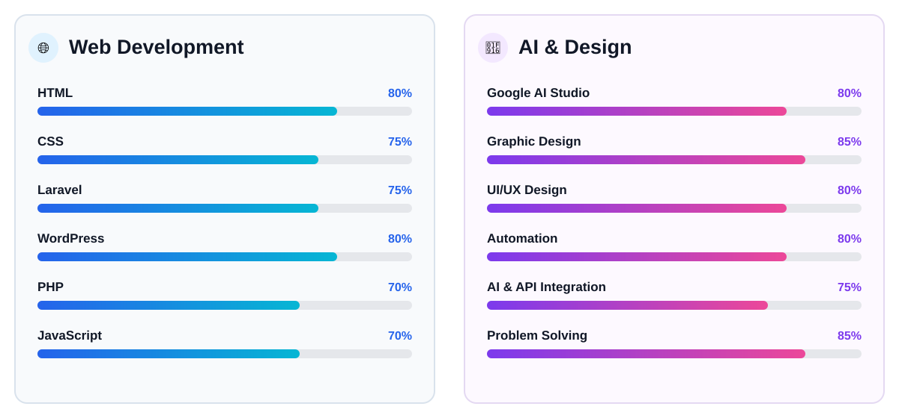

# 👋 Hey, I'm Abdullah Al Arafat!

  

I'm a passionate <b>Web Developer, AI Enthusiast & Graphic Designer</b>
who loves building useful digital products, experimenting with AI,
and turning ideas into real-world projects.

---

## 👨‍💻 More About Me

<table>
<tr>

<td width="58%" valign="top">

- 🔭 I'm currently working on <b>AI-powered Web Apps & Automation</b>
- 🌱 I'm currently learning <b>Advanced Full-Stack Development & AI</b>
- 🤝 I'm looking to collaborate on <b>Web, AI & Automation Projects</b>
- 💡 I love exploring new technologies and building useful tools
- 🎨 I'm also passionate about <b>Graphic Design & UI/UX</b>
- 🤖 I enjoy experimenting with <b>AI & Automation Workflows</b>
- 🔥 Most of my projects are focused on solving real-world problems
- 💬 Ask me about <b>Web Development, Laravel, WordPress & AI</b>
- ⚡ I love turning ideas into working products

</td>

<td width="42%" align="center">

</td>

</tr>
</table>

---

## 🛠️ Languages & Tools

---

## 🤖 AI & Automation

---

## 📊 GitHub Stats

<table>
<tr>

<td width="50%" align="center">

</td>

<td width="50%" align="center">

</td>

</tr>
</table>

---

## 🔥 GitHub Streak

---

## 📈 Contribution Activity

---

<h2>💻 My Development Skills</h2>

  

---

## 🚀 My Projects

<table>
<tr>

<td width="50%" valign="top">

### 🤖 AI Creator Toolkit

An AI-powered toolkit for content creators, freelancers and students.

**Features**

- 📝 Text Summarizer
- 📄 PDF Summarizer
- ✍️ Caption Generator
- #️⃣ Hashtag Generator
- 🔤 Grammar Fixer
- 🌐 Translator
- 💡 Prompt Generator
- 🔄 AI Rewriter

</td>

<td width="50%" valign="top">

### 📺 E-SPORTYNET

A sports streaming platform for live and recorded sports content.

**Features**

- ⚽ Football
- 🏏 Cricket
- 🎮 Gaming
- 📅 Match Schedule
- 📡 Live Channels
- 🔐 Firebase Authentication
- ⚙️ API Management
- 🛡️ Admin Panel

</td>

</tr>

<tr>

<td width="50%" valign="top">

### ⚔️ Solo Leveling System

A full-stack ranking and profile system inspired by Solo Leveling.

**Features**

- 🏆 Hero Leaderboard
- ⚡ Level System
- 🔥 Aura System
- 👤 User Management
- 🌍 Country Ranking
- 🖼️ Profile Picture
- ✅ Verification System
- 🛡️ Admin Dashboard

</td>

<td width="50%" valign="top">

### 🤖 WABOT

An AI-powered WhatsApp assistant and automation system.

**Features**

- 💬 AI Chat
- 🧠 Memory
- ⚙️ Workflow Automation
- 📱 WhatsApp Integration
- 🔗 API Integration
- 🤖 Automated Responses

</td>

</tr>
</table>

---

## 🎯 What I Love Building

<table>
<tr>

<td align="center">🌐 <b>Websites</b></td>
<td align="center">🤖 <b>AI Apps</b></td>
<td align="center">⚙️ <b>Automation</b></td>
<td align="center">📱 <b>Web Apps</b></td>

</tr>

<tr>

<td align="center">🎨 <b>UI/UX</b></td>
<td align="center">🔥 <b>Firebase Apps</b></td>
<td align="center">💬 <b>Chatbots</b></td>
<td align="center">📊 <b>Dashboards</b></td>

</tr>
</table>

---

## 🧰 My Tech Stack

---

## 🤝 Connect With Me

---

## 💭 Developer Quote

<i>
"Code is not just about solving problems. 
It's about turning ideas into reality."
</i>

---

### ⭐ Thanks for visiting my profile!

